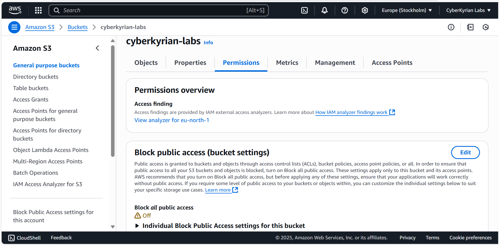
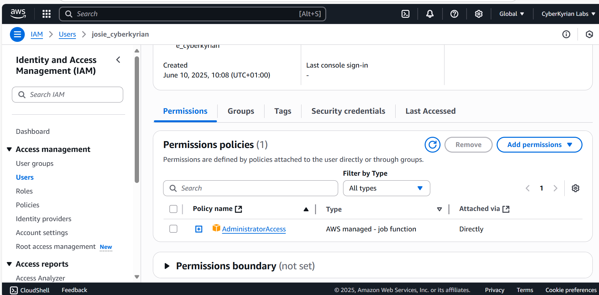
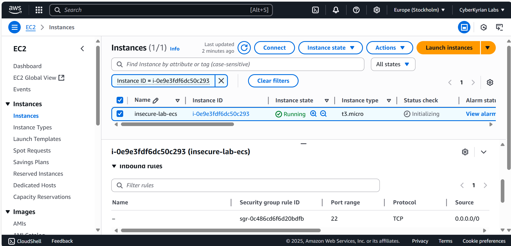
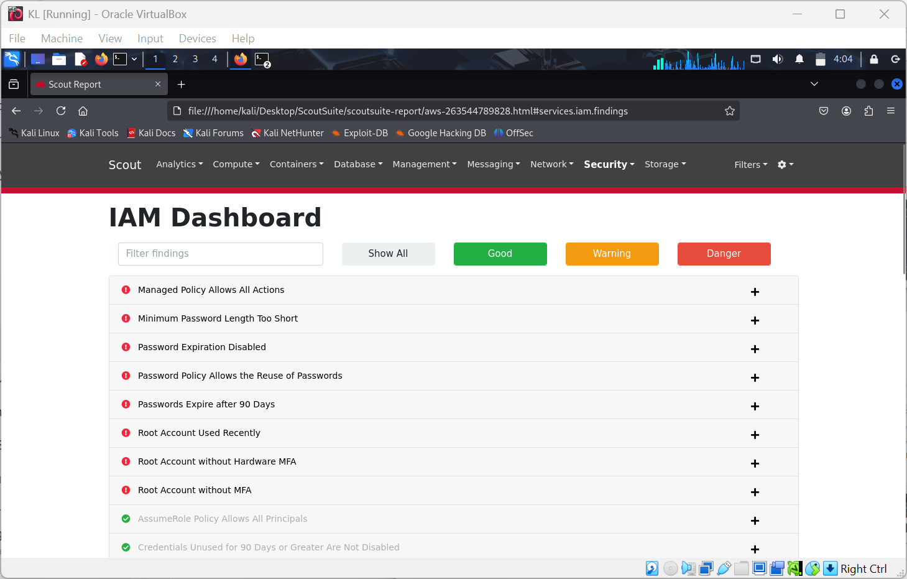
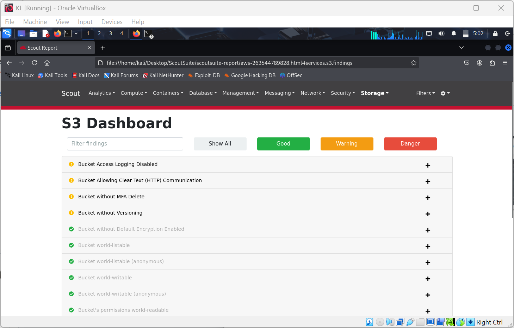
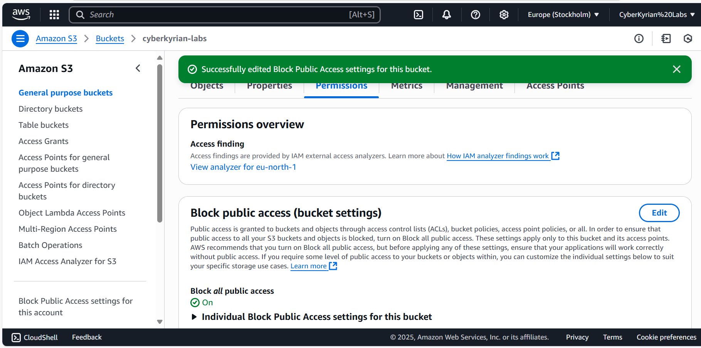
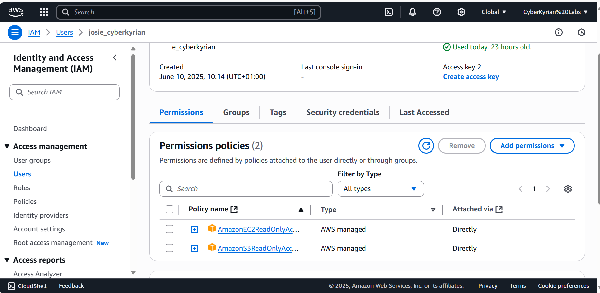
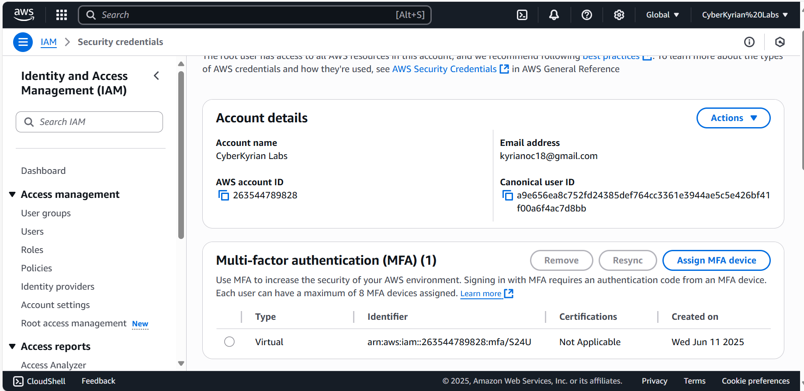
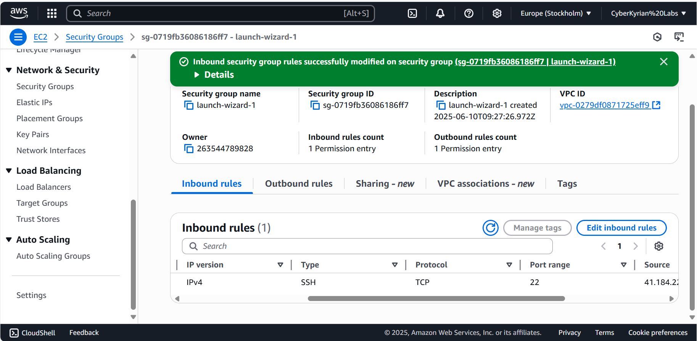
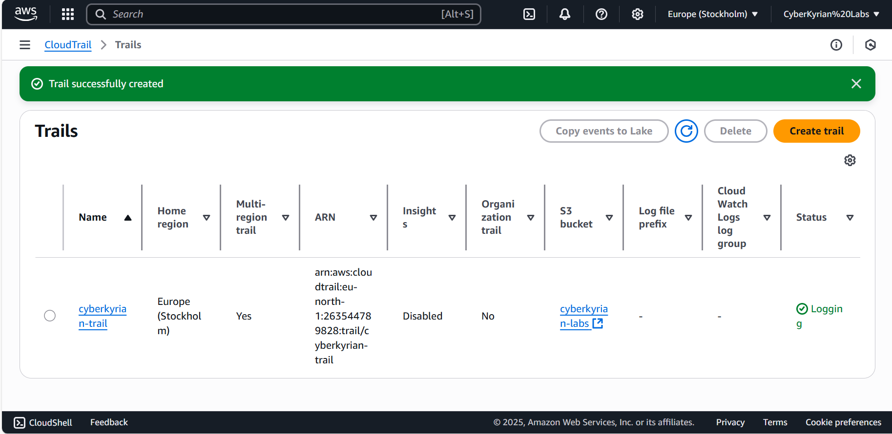

# AWS Cloud Security Misconfiguration Audit Lab

### Author: Kyrian Onyeagusi
🔗 [LinkedIn](https://www.linkedin.com/in/kyrian-onyeagusi/) | 📧 [Email](mailto:kyrianoc18@gmail.com)

### Focus: Real-world AWS misconfigurations and secure cloud practices

### Environment: AWS (Remote Lab)

---

## Tools & Skills Demonstrated

* AWS IAM Policy Management
* Cloud Resource Auditing with ScoutSuite
* S3 Permission Hardening
* Network Security Group Configuration
* CloudTrail Log Monitoring

---

## Lab Overview

This lab simulates common security misconfigurations in an AWS cloud environment and demonstrates how to audit and remediate them using industry-recognized tools. The lab focuses on exposing real-world vulnerabilities related to S3 buckets, IAM permissions, and EC2 security groups — all of which are commonly exploited due to poor configurations.

---

## Environment Setup

### AWS Services Used:

* Amazon S3
* IAM (Identity and Access Management)
* Amazon EC2

### Simulated Insecure Configurations:

* Publicly accessible S3 bucket (`cyberkyrian-labs`)
* IAM user (`josie_cyberkyrian`) with `AdministratorAccess` policy
* EC2 instance with SSH (port 22) open to the world (`0.0.0.0/0`)

> ✅ **Screenshot:** S3 bucket with “Block all public access” disabled
> 

> ✅ **Screenshot:** IAM user with full admin permissions
> 

> ✅ **Screenshot:** EC2 security group allowing unrestricted SSH
> 

---

## Cloud Audit Tools Used

### ScoutSuite

* Used to perform a full security assessment of AWS environment
* Produces HTML reports with clear risk severity levels

> ✅ **Screenshot:** ScoutSuite report flagging IAM over-privilege and S3 misconfigurations
> 

> 

---

## Remediation Actions Taken

### S3 Bucket:

* Set bucket policy to private
* Enabled "Block all public access"

> ✅ **Screenshot:** Updated bucket policy with public access blocked
> 

### IAM User:

* Replaced `AdministratorAccess` with least privilege policy
* Enabled MFA for both root and IAM user accounts

> ✅ **Screenshot:** MFA setup for `josie_cyberkyrian`
> 

> 

### EC2 Security Group:

* Restricted SSH access from `0.0.0.0/0` to a single trusted IP address
* Added a rule to log all changes using CloudTrail

> ✅ **Screenshot:** Security group rules updated with restricted SSH
> 

> ✅ **Screenshot:** CloudTrail enabled and logging
> 

---

## Tools & Skills Demonstrated

* AWS IAM Policy Management
* Cloud Resource Auditing with ScoutSuite
* S3 Permission Hardening
* Network Security Group Configuration
* CloudTrail Log Monitoring

---

## 📌 Conclusion

This lab demonstrates how misconfigured AWS services can expose organizations to critical risks. By simulating real-world issues and walking through the audit and remediation steps, I’ve shown my ability to not only detect but also secure cloud assets according to best practices.

## 🔗 Connect

**Kyrian Onyeagusi**
🔗 [LinkedIn](https://www.linkedin.com/in/kyrian-onyeagusi/) | 📧 [Email](mailto:kyrianoc18@gmail.com)
